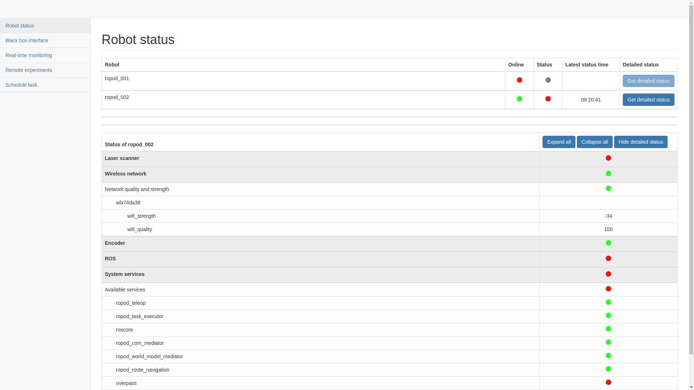
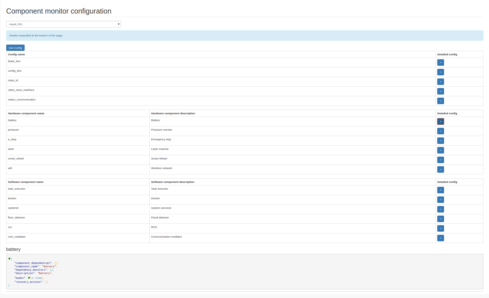
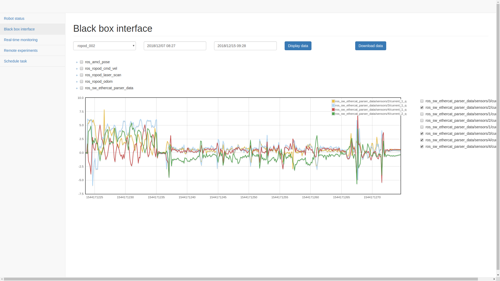
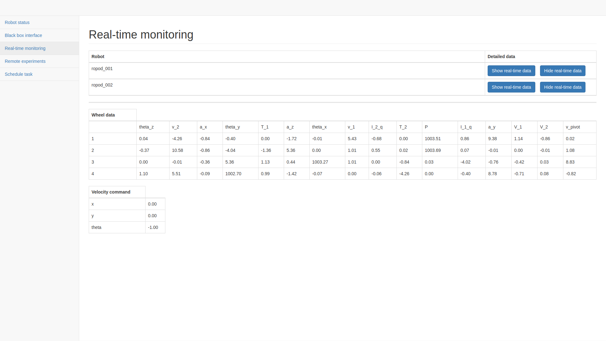
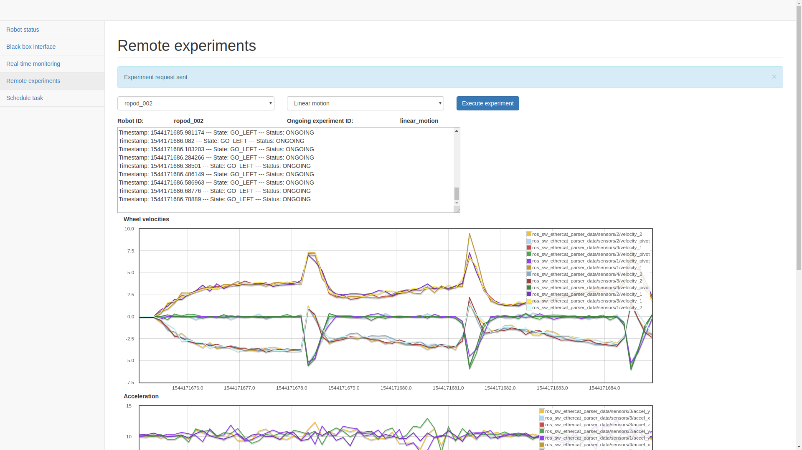
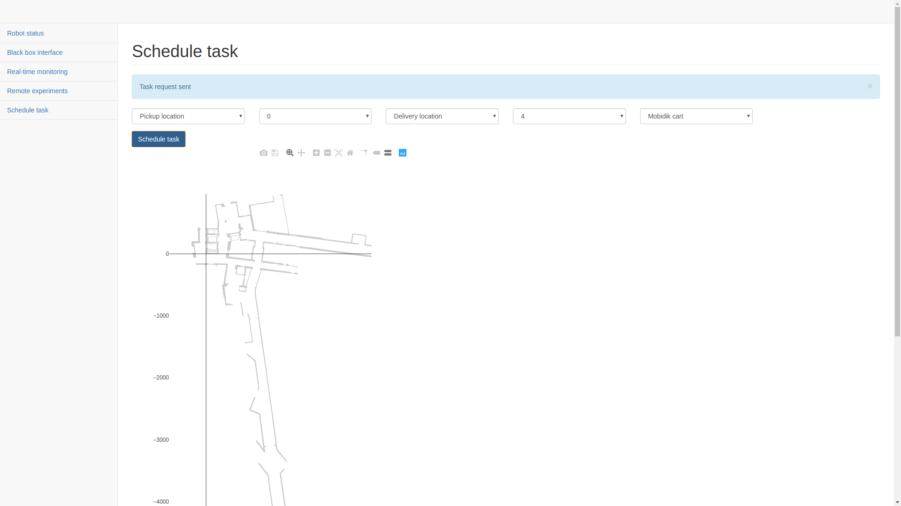

# Remote Monitoring

A web interface for remotely monitoring robots and their operation. The interface is developed in Python 3 using Flask (there are no plans for backwards compatibility with Python 2).

This interface is developed as part of the ROPOD project and thus has multiple direct and indirect dependencies on other components developed in the project. In particular:
* [Zyre](https://github.com/zeromq/zyre)/[Pyre](https://github.com/ropod-project/pyre) is used for communication between robots and the application; the `pyropod` package defined in [`ropod_common`](https://github.com/ropod-project/ropod_common) should be set up to make this communication possible
* a black box and a black box query interface as defined at https://github.com/ropod-project/black-box are assumed to exist for each monitored robot. Since Zyre is used for communication, the black box query interface is assumed to be accessible as a Zyre node
* a set of utilities for working with black box data, which are available at https://github.com/ropod-project/black-box-tools
* a component monitoring library as described at https://github.com/ropod-project/component-monitoring is assumed to continuously advertise the status of robot components (also via Zyre)
* an experiment execution interface as defined at https://git.ropod.org/ropod/execution-monitoring/ropod_experiment_executor is expected to be running so that remote experiments can be performed and monitored

## Functionalities

The web application provides six main functionalities:
1. **Monitoring the status of robot components**: Information on various robot components (both hardware and software) is provided so that robots can be monitored in real time

2. **Retrieving the configuration of the component monitors**: The status of the robot components is obtained by component monitors, whose configuration can be retrieved for the purpose of transparency

3. **Retrieving and displaying historical black box data associated with a particular robot**: Data stored on the black box associated with a robot can be queried and displayed

4. **Displaying the latest black box data associated with a particular robot**: Important variables (such as measurements from the sensor wheels and velocity commands) are shown in real time

5. **Performing remote experiments for simplified remote debugging**: Requests for various predefined experiments can be sent to robots; during the execution of an experiment, continuous progress feedback and live data from the robot's black box are displayed

6. **Sending task requests**: Simple transportation task requests can be sent to the [fleet management library](https://git.ropod.org/ropod/ccu/fleet-management)

## Assumptions

* A robot and its associated black box have the same numeric ID, such that if a robot has an ID `robot_<xyz>`, the black box will have an ID `black_box_<xyz>` (the underscore separating the numeric ID from the string ID is assumed to be there as a delimiter)
* The Zyre-based communication between the interface and the robots/black boxes uses JSON messages whose schemas are defined in https://git.ropod.org/ropod/communication/ropod-models

## Design principles

The application is exposed as a `remote_monitoring` Python package and is developed in a modular manner using Flask blueprints, such that each major functionality has its own blueprint, namely:
* `robot_status`: Handlers and helper methods for providing the status of robots
* `black_box`: Handlers for retrieving black box data
* `experiments`: Handlers for sending experiment requests and monitoring the status of ongoing experiments
* `task_scheduling`: Handlers for sending task requests to the fleet management system
* `central_operator_console`: 
* `component_management`: 
* `component_monitoring_config`: 
* `real_time_monitoring`: 

Each of these blueprints is a separate package in the `remote_monitoring.blueprints` subpackage.

The most important configuration parameters for the application (robot information, list of experiments) are stored in a `remote_monitoring_config` MongoDB database.

Functionalities common to the application are defined directly in the `remote_monitoring` package:
* `common.py`: Defines a `Config` class for interacting with the configuration database as well as various variables reused throughout the application (in particular, message definitions and a `socketio` object)
* `black_box_utils.py`: Defines a `BBUtils` class with various static methods for simplified black box interaction
* `zyre_communicator.py`: Defines a `ZyreWebCommunicator` class that takes care of all Zyre communication in the application
* `init_config_db.py`: Populates the `remote_monitoring_config` database with all necessary parameters

## Usage

### Native installation

If all application dependencies are installed natively, running the application requires:
1. installing the `remote_monitoring` Python package: `sudo python3 setup.py install` (or `sudo python3 setup.py develop` if installation is not desired)
2. starting the `app.py` script, namely running the command `python3 app.py`; the application is then accessible at port `5000`

**Note**:
1. When cloning for the first time, clone recursively using: `git clone -b develop --recursive <url>`
2. The configuration database should be populated before starting the application for the first time (the `init_config_db.py` script can be used for this purpose).

### Docker

To run the application without installing any dependencies, we additionally provide a Docker image.

The Docker image can be created by running `docker-compose build` in the root of this repository. `docker-compose up` will then start two Docker containers - the web application and a MongoDB container that runs on port 27019 and is thus separate from the default MongoDB instance running on port 27017 (this is particularly useful on shared machines since it does not pollute the default instance with potentially unwanted databases). To populate the configuration database for the application when using the Docker image and interact with the correct database, the value of the `db_port` field in the `Config` class in `common.py` should be updated accordingly.

If the default MongoDB instance should be used instead, simply commenting out the `mongo` section in the `docker-compose.yml` file before starting the containers will prevent the MongoDB container from running.
